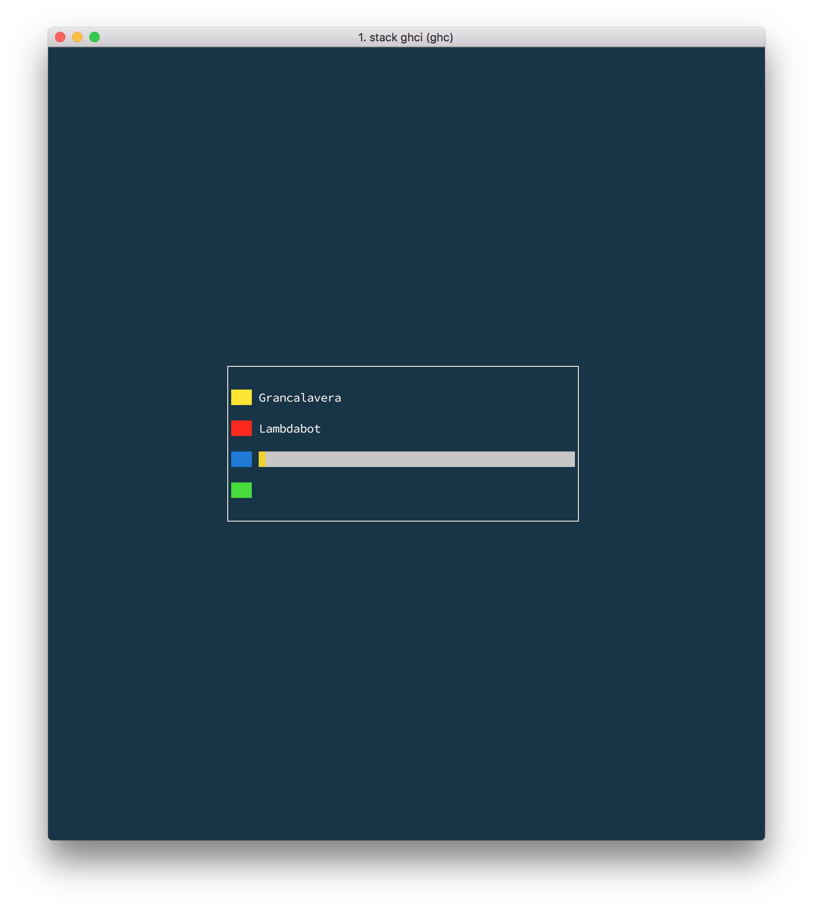
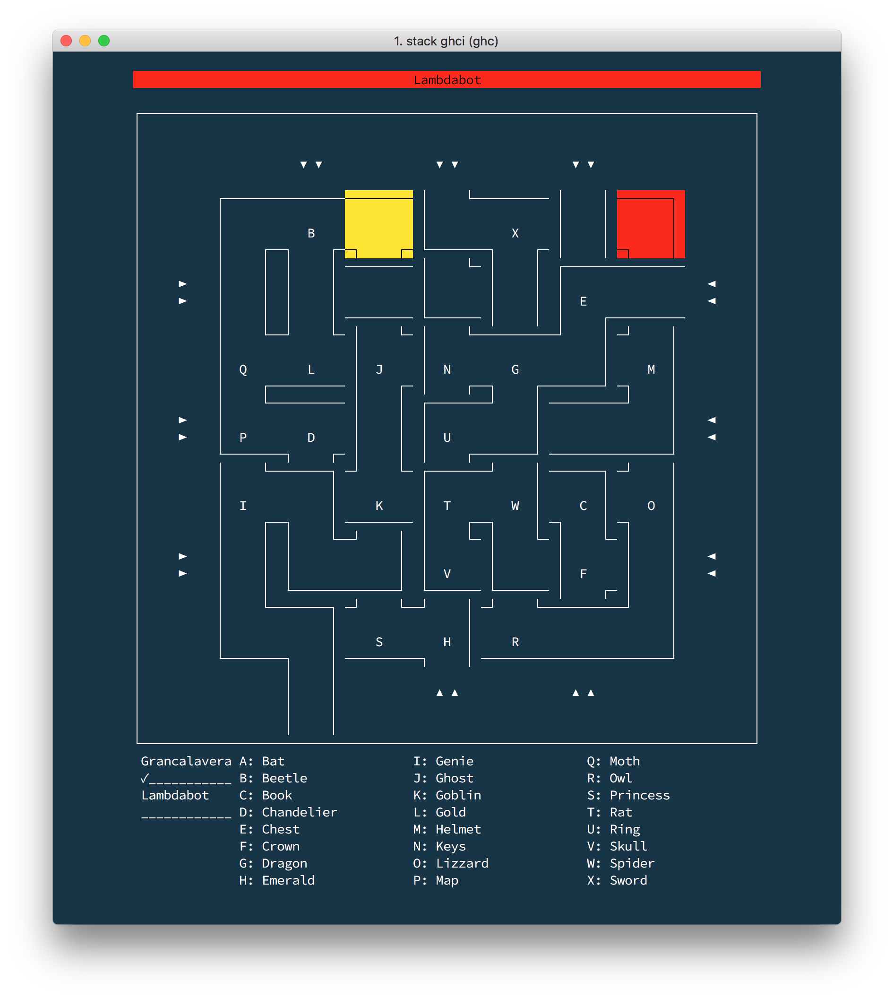

# labyrinth [](https://travis-ci.org/grancalavera/labyrinth)

> A clone of Ravensburger's Labyrinth

## Installation instructions

I have only tested this project using [Stack](https://docs.haskellstack.org/en/stable/README/). Currently the only way to get the project runnig is building it from source:

```bash
~ git clone git@github.com:grancalavera/labyrinth.git
~ cd labyrinth
~ stack build
~ stack exec labyrinth
```

That should do it...

## Screenshots

This is still work in progress, but so far it looks like this:






## Game Rules

> Read the rules [here](./etc/rules.md).
